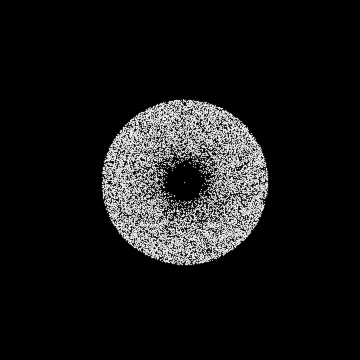

# CUDA N-Body Simulation

Gravitational N-body simulation accelerated on the GPU with CUDA, taking a
50,000-body simulation from ~26 minutes on CPU to ~1.5 seconds on a T4.

## Benchmark (50,000 bodies, 100 steps, T4 GPU)

| Version              | Time         | Speedup vs CPU |
|----------------------|--------------|----------------|
| CPU (single-thread)  | 1,545,927 ms | 1×             |
| Naive CUDA           | 2,003 ms     | ~772×          |
| + Shared-mem tiling  | 1,500 ms     | ~1,030×        |
| + SoA layout         | 1,432 ms     | ~1,080×        |

## What I learned
- Naive parallelism (one thread per body) delivered the biggest win — ~772× — just from doing 50k independent force calculations at once instead of in sequence.
- Shared-memory tiling and an AoS→SoA layout gave only single-digit-to-25% further gains. Profiling that told me the kernel is **compute-bound** on `rsqrtf`, not memory-bound — so memory optimizations had limited headroom.
- Simulation stability required matching each body's orbital velocity to the softened gravity and using a small timestep; otherwise the disk gains energy and flies apart.

## Files
- `nbody_cpu.cpp` — CPU baseline
- `nbody.cu` — naive CUDA kernel
- `nbody_tiled.cu` — shared-memory tiled version
- `nbody_soa.cu` — structure-of-arrays layout
- `nbody_render.cu` — disk-galaxy renderer (writes frame data)
